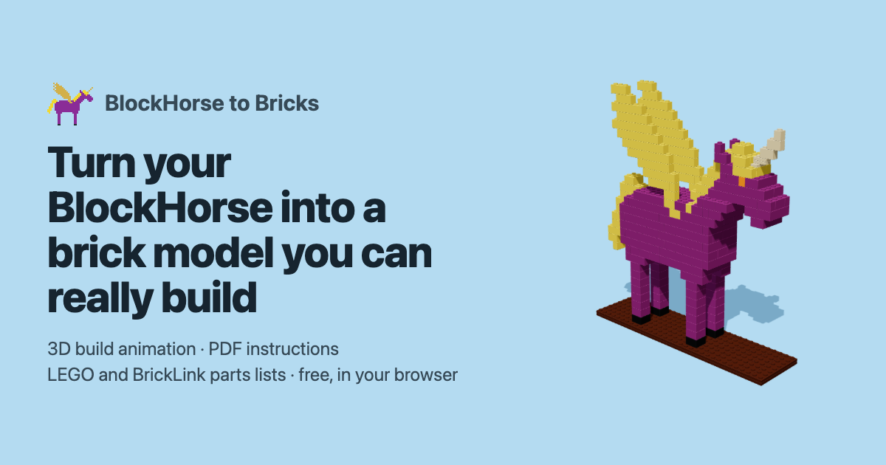
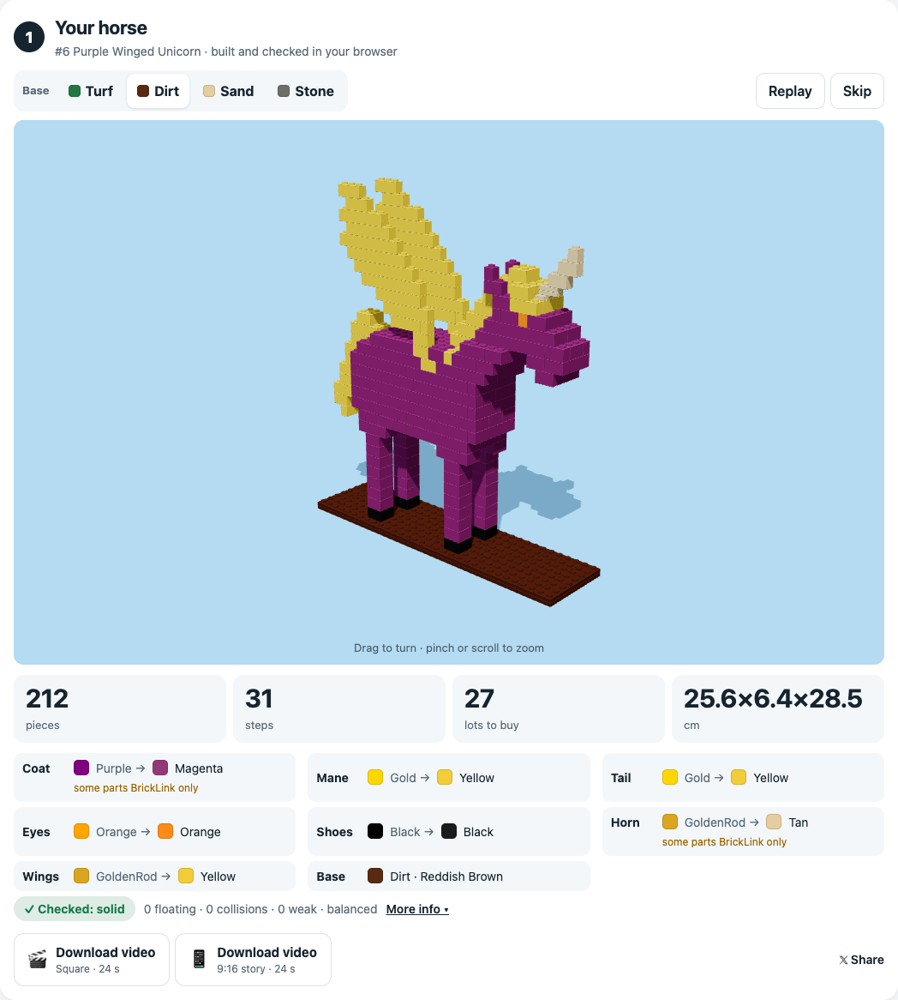
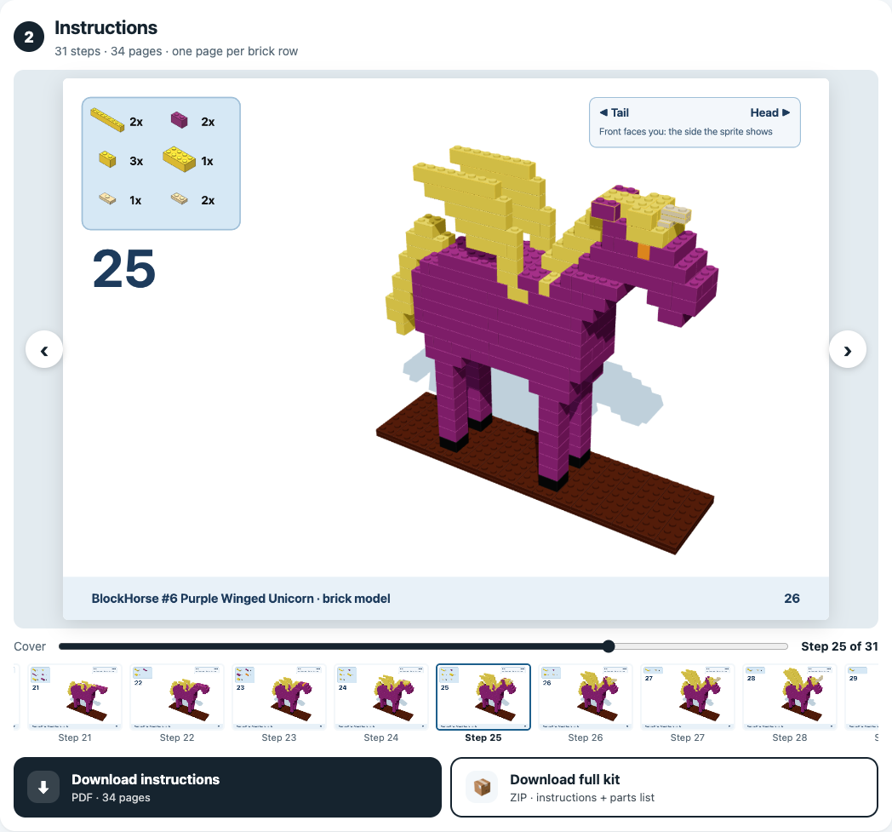
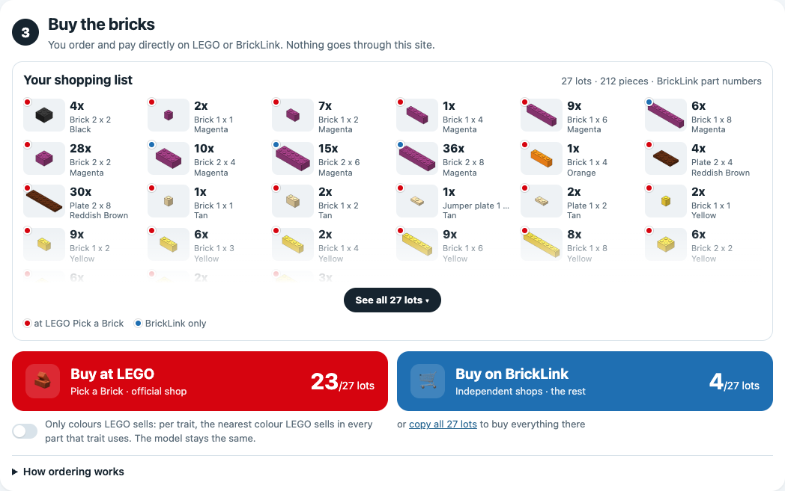

# BlockHorse to Bricks

Turn any of the 260 [BlockHorses](https://github.com/blockhorses/BlockHorses) into a brick model you can really build.

<p align="center">
  <a href="https://blockhorses.github.io/blockhorse-to-bricks/"></a>
</p>

<h3 align="center">👉 <a href="https://blockhorses.github.io/blockhorse-to-bricks/">Open BlockHorse to Bricks</a> 👈</h3>
<p align="center">Free · runs in your browser</p>

## How to use

1. **Pick your BlockHorse**: type its number (1 to 260), step through them with ‹ and ›, try **Random**, or click one of the examples (one horse, pegasus, unicorn and winged unicorn). The original pixel sprite and the token's name are shown, for example "#6 Purple Winged Unicorn".
2. **① Your horse**: watch it build in 3D and turn it with your finger or mouse. Choose the base colour: Turf, Dirt (the default), Sand or Stone. Each trait's original colour is shown next to the brick colour it became. "More info" shows every check. Download a video of the build (square or 9:16).
3. **② Instructions**: flip through the step-by-step booklet on the page, then download it as a PDF or as a full kit (PDF and parts list). Every step page shows which way is head and tail; the front, facing you, is the side the sprite shows.
4. **③ Buy the bricks**: see your shopping list, then **Buy at LEGO** (a Pick a Brick upload file) or **Buy on BrickLink** (a wanted list to paste). **Only colours LEGO sells** never changes the model: per trait, it picks the nearest colour LEGO sells in every part that trait uses.

<p align="center">
  
  
  
</p>

## The build

- **Scale.** One sprite pixel is one stud wide and one brick (3 plates) tall, so the model is 20% taller than the sprite. Every build is 32 × 8 studs (25.6 × 6.4 cm) on a base of two crossed plate layers.
- **Depth.** The model is 6 studs deep. The legs and shoes come in two pairs (front and back), the body is full depth, the neck rises out of the shoulder 4 studs deep like the head, the ears stand at each side with the mane between them, the tail and mane crest are 2 studs, and each wing is one stud thick on the outer face.
- **Horn.** A unicorn's horn is one stud thick and centred on the head, half a stud off the grid: it starts on a **1 × 2 jumper plate** (BrickLink 15573, one centre stud), two 1 × 2 plates finish that brick row, and 1-stud-wide bricks step up and forward. Each step is held by a single stud, by design.
- **Four builds.** Every horse of a species uses the same build; only the colours change. The builds are made offline by `scripts/build-horses.ts`, which searches 3,000 random tilings per species and keeps the best (one connected group, no weak joints, the fewest seams and pieces). They are in `src/data/builds.json`.

| Species | Horses | Pieces | Height incl. base | Seed |
|---|---|---|---|---|
| Horse | 227 | 174 | 23.7 cm | 323 |
| Pegasus | 11 | 205 | 28.5 cm | 2775 |
| Unicorn | 15 | 180 | 25.6 cm | 323 |
| Winged Unicorn | 7 | 211 | 28.5 cm | 2775 |

## What's inside

- **100% static.** Everything runs in the visitor's browser. No server, no AI, no API key, no tracking.
- **Honest checks.** Every model is checked on its final piece list: studs connected, 0 floating pieces, 0 collisions, centre of mass over the base, and weak joints. Studs are matched on a half-stud grid, so the jumper's single centre stud and the half-stud horn are checked like everything else. A piece larger than 1 × 1 held by a single stud counts as a weak joint; a 1 × 1 always sits on one stud, so it doesn't. A failed check is shown, never hidden.
- **Colours.** Each trait (coat, mane, tail, eyes, shoes, horn, wings) is a CSS colour name in the token's SVG. It is matched to the nearest of 35 opaque brick colours with CIEDE2000. Traits that touch keep different brick colours when their original colours differ: mane/coat, tail/coat, eyes/coat, shoes/coat, wings/coat, eyes/mane, horn/mane and horn/coat.
- **Order the bricks.** A Pick a Brick upload file in LEGO's own CSV format (400 references and 999 units per line at most, split into several files when needed) and a BrickLink wanted list (Want → Upload → "Upload BrickLink XML format"). Element IDs come from [Rebrickable](https://rebrickable.com)'s free exports, built into `src/data/elements.json` by `scripts/build-elements.ts` (no live calls). Nothing is sold here: you order and pay on LEGO or BrickLink.
- **Exports.** Full kit ZIP (PDF booklet with one page per brick row, the step's parts in colour and outlined in yellow, plus a parts inventory; CSV parts list), and square or 9:16 videos of the build ending on the flipping booklet.

## Data

- `src/data/horses.json`: trait colours of tokens 1 to 260. Regenerate with `npx tsx scripts/extract-horses.ts path/to/BlockHorses`, from a clone of [blockhorses/BlockHorses](https://github.com/blockhorses/BlockHorses) (`api/horse/<n>.svg`).
- `src/data/builds.json`: the four builds. Regenerate with `npx tsx scripts/build-horses.ts` (about 16 s). The tests check that it reproduces the agreed builds in `blockhorse-reference/builds/` piece for piece.
- `src/data/elements.json`: LEGO element IDs. Regenerate with `npx tsx scripts/build-elements.ts` after downloading Rebrickable's `elements`, `parts` and `colors` exports into `real/` (git-ignored).

## Develop

```bash
npm install
npm run dev        # http://localhost:5173
npm test           # unit tests: builds, horses, checks, colours, exports
npm run build      # static site in dist/
```

`scripts/ui-flow.cjs` drives the built site in Chrome and screenshots every section for one horse of each species. `scripts/site-images.cjs` renders `public/og.png` and the screenshots in `docs/`.

## Credits

Based on [Punk to Bricks](https://github.com/hs7j4yk4sz-boop/punk-to-bricks) by John Karp (MIT), which was inspired by [@victormustar](https://x.com/victormustar)'s Microduck. BlockHorses by Andrew B Coathup: [blockhorses/BlockHorses](https://github.com/blockhorses/BlockHorses) (MIT).

## Notes

Unofficial fan project · Not affiliated with, sponsored or endorsed by the LEGO Group or BrickLink. LEGO® is a trademark of the LEGO Group. Parts data: Rebrickable. No purchases, payments or personal data go through this site. Models are computer-checked, not physically build-tested.

## License

[MIT](LICENSE). See also the [disclaimer](DISCLAIMER.md). The license covers the code only, not any trademark.
